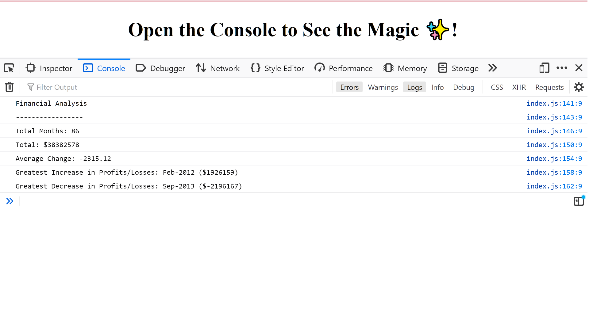

# JC--Console-Finances

## JC Console Finances

The motivation for this project was to create code in JavaScript to calculate the financial records of a company.

The code analyzes a dataset composed of arrays with two fields: Date and Profit/Losses.

JC Console-Finances produces a financial analysis of the following: 
- The total number of months included in the dataset.
- The net total amount of Profit/Losses over the entire period.
- The average of the changes in Profit/Losses over the entire period.
- The greatest increase in profits (date and amount) over the entire period.
- The greatest decrease in losses (date and amount) over the entire period.

## Installation

N/A

## Usage

URL of the deployed application:
https://jeanj22.github.io/JC--Console-Finances/

To display the financial analysis in your browser you must use the inspector tool, as shown below: 
1. Select the above url/link of the deployed application to open it your browser,
2. Select the 'right-click' button on your mouse/trackpad,
3. Then select 'Inspect' from the menu,  
4. Then 'Console' at the top of the inspector box,
5. The financial analysis will then be displayed. 

## Screenshot 
 

## Credits

Resources consulted:
1: https://developer.mozilla.org/en-US/docs/Web/JavaScript/Reference/Template_literals
2. https://www.w3schools.com/js/js_string_templates.asp
3: https://developer.mozilla.org/en-US/docs/Web/JavaScript/Reference/Global_Objects/Math/round

## License
N/A
